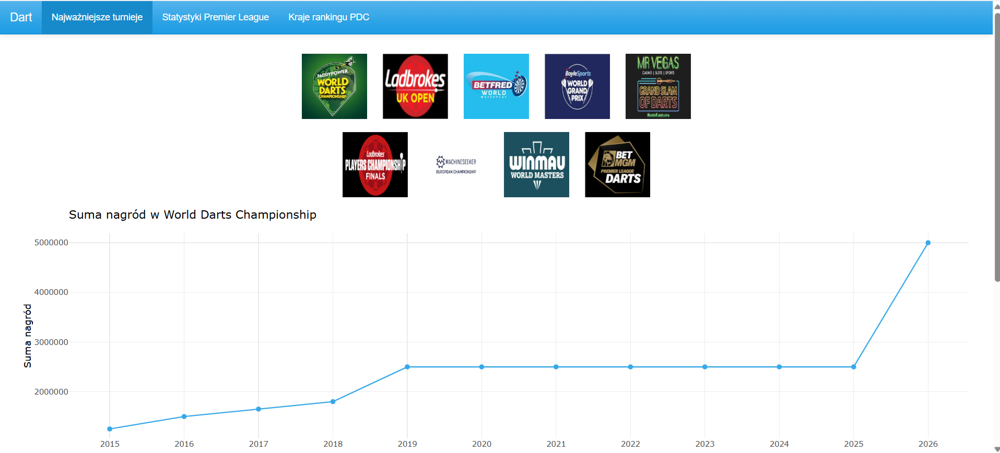
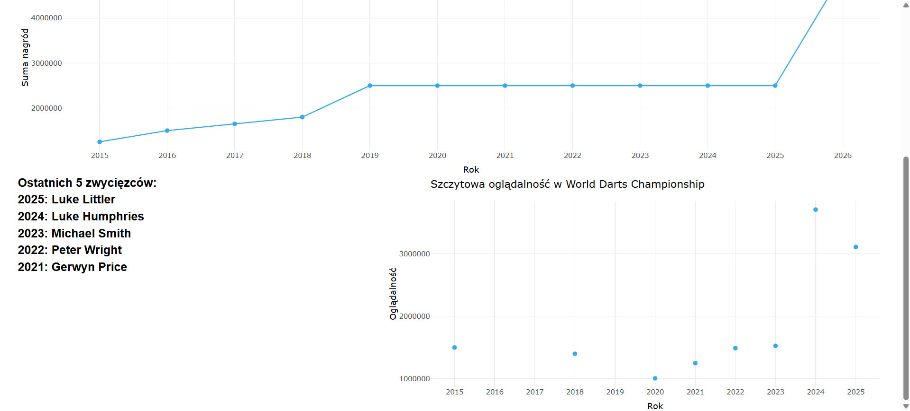
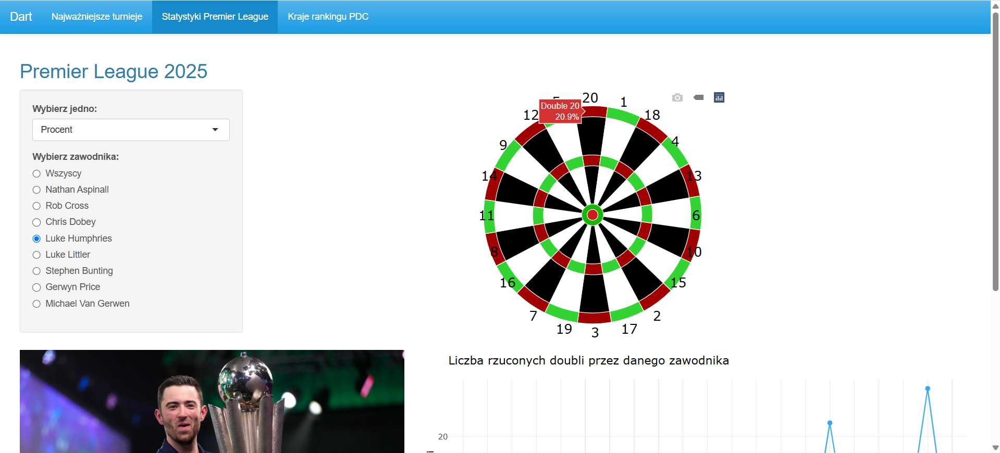
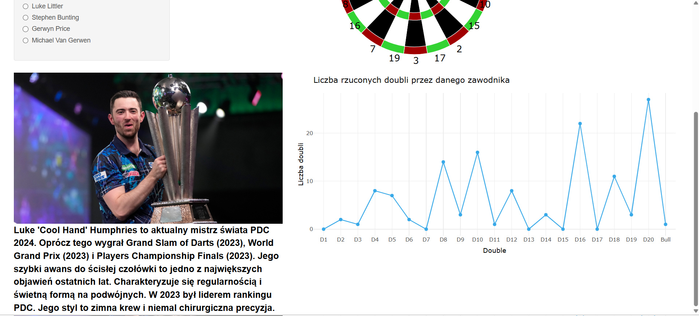
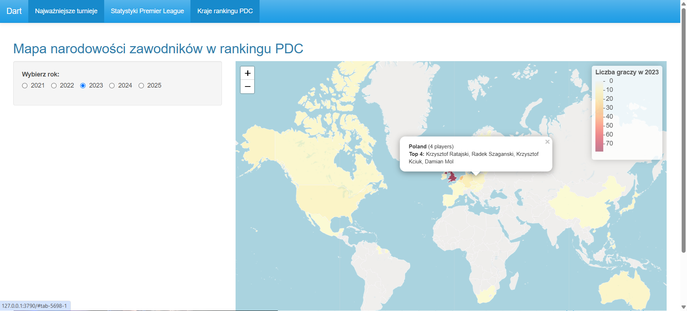

# dart-analysis — opis projektu i uruchomienie

Aplikacja prezentuje **analizy turniejów darta** (PDC) w formie interaktywnego dashboardu (Shiny).
Zawiera m.in.:
- przegląd **najważniejszych turniejów** i ich **sum nagród** w latach,
- **statystyki Premier League** (wraz z wizualizacją „tarczy”),
- przegląd **krajów w rankingu PDC**.

Projekt jest zaprojektowany do oglądania w **przeglądarce** (nie w Viewerze RStudio). W Viewerze niektóre elementy mogą nie wyglądać idealnie — to normalne.

---


## Zakładki (co zobaczysz w aplikacji)

### 1) Najważniejsze turnieje
- **Siatka 9 ikon** (w `www/icon*.jpg`) reprezentujących turnieje z wektora:
  ```
  c("World Darts Championship","UK Open","World Matchplay","World Grand Prix",
    "Grand Slam of Darts","Players Championship Finals","European Championship",
    "World Masters","Premier League Darts")
  ```
- Po kliknięciu ikony wyświetla się **wykres sum nagród** dla wybranego turnieju (punkty + linia, oś X = `Year`).
- Dla **ikony nr 1** (WDC) pojawia się dodatkowo panel:
  - **tekst** (lista zwycięzców z `zwyciezcy.xlsx`),
  - **wykres oglądalności** z `ogladalnosc.xlsx` (`Peak_viewership`).

### 2) Statystyki Premier League
- Wczytuje/prezentuje dane specyficzne dla Premier League (m.in. **„tarcza”** – grafika pokazujaca ilosc dubli w `www/dartboard.png`).  
- Wykresy/tekst bazują na obiekcie danych przygotowanym przy starcie.

### 3) Kraje rankingu PDC
- Zestawienia/wykresy na poziomie krajów (np. suma punktów, liczba graczy, itp.).  
- Widoki tabelaryczne/wykresowe zależnie od danych.

---

## Szybki start (zalecane)

1) **Klon repo**:
```bash
git clone https://github.com/SatukerRekiner/dart-analysis.git
cd dart-analysis
```

2) **Upewnij się, że dane i obrazy są na miejscu**  
   - `www/icon1.jpg ... icon9.jpg`, `www/dartboard.png`  
   - pliki `*.xlsx` (`nagrody.xlsx`, `ogladalnosc.xlsx`, `zwyciezcy.xlsx`) w oczekiwanej lokalizacji (patrz kod)

3) **Uruchom starter** (w RStudio z katalogu projektu):
```r
source("start_from_order.R")
```
Starter:
- **wczyta pliki dokładnie wg `START_ORDER.txt`** ,
- zarejestruje `/static → ./www` (żeby obrazki działały w przeglądarce),
- spróbuje uruchomić aplikację 

**Uwaga:** Otwieraj w **przeglądarce** („Open in Browser”), nie w RStudio Viewer.


---

## Zrzuty ekranu







