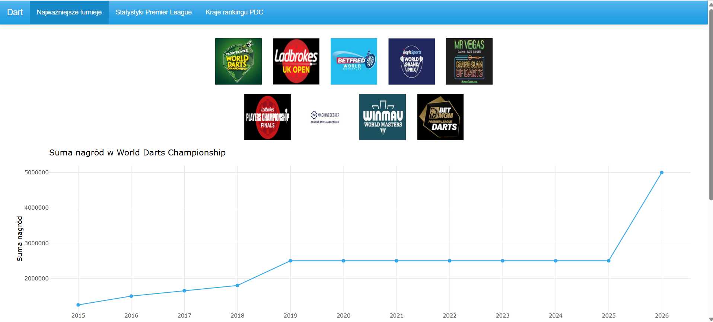
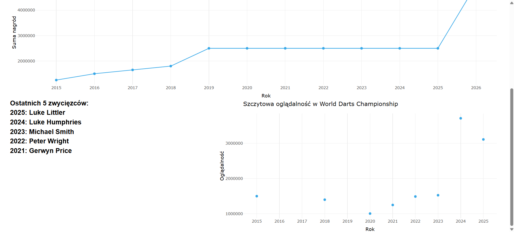
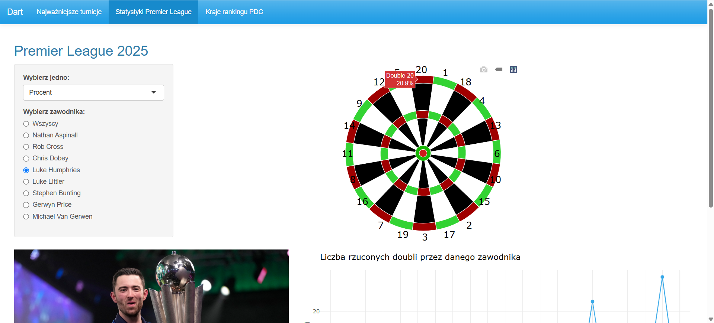
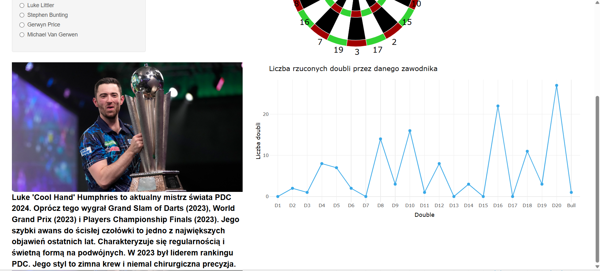
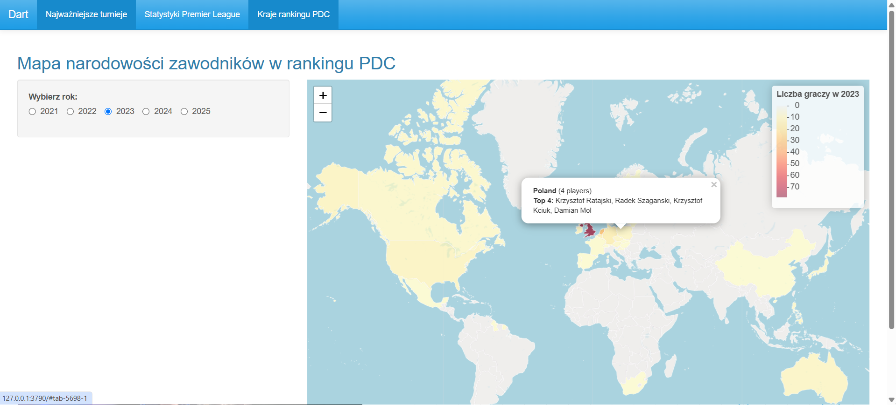

*[🇵🇱 Przejdź do polskiej wersji (Go to Polish version)](#wersja-polska)*

---

# dart-analysis — project description and setup

The application presents **darts tournament analysis** (PDC) in the form of an interactive dashboard (Shiny).
It contains, among others:
- an overview of the **most important tournaments** and their **total prize pools** over the years,
- **Premier League statistics** (along with a "dartboard" visualization),
- an overview of **countries in the PDC ranking**.

The project is designed to be viewed in a **browser** (not in the RStudio Viewer). Some elements may not look perfect in the Viewer — this is normal.

---

## Tabs (what you will see in the app)

### 1) Major tournaments
- **Grid of 9 icons** (in `www/icon*.jpg`) representing tournaments from the vector:
  ```R
  c("World Darts Championship","UK Open","World Matchplay","World Grand Prix",
    "Grand Slam of Darts","Players Championship Finals","European Championship",
    "World Masters","Premier League Darts")
  ```
- Clicking an icon displays a **prize pool chart** for the selected tournament (points + line, X-axis = `Year`).
- For **icon no. 1** (WDC), an additional panel appears:
  - **text** (list of winners from `zwyciezcy.xlsx`),
  - **viewership chart** from `ogladalnosc.xlsx` (`Peak_viewership`).

### 2) Premier League Statistics
- Loads/presents data specific to the Premier League (including a **"dartboard"** – a graphic showing the number of doubles in `www/dartboard.png`).  
- Charts/text are based on the data object prepared at startup.

### 3) PDC ranking countries
- Summaries/charts at the country level (e.g., total points, number of players, etc.).  
- Tabular/chart views depending on the data.

---

## Quick start (recommended)

1) **Clone the repo**:
```bash
git clone [https://github.com/SatukerRekiner/dart-analysis.git](https://github.com/SatukerRekiner/dart-analysis.git)
cd dart-analysis
```

2) **Make sure data and images are in place** - `www/icon1.jpg ... icon9.jpg` 
   - `*.xlsx` files (`nagrody.xlsx`, `ogladalnosc.xlsx`, `zwyciezcy.xlsx`) in the expected location (see code)

3) **Run the starter** (in RStudio from the project directory):
```r
source("start_from_order.R")
```
Starter:
- **will load files exactly according to `START_ORDER.txt`**,
- will register `/static → ./www` (so that images work in the browser),
- will try to run the application 

**Note:** Open in the **browser** ("Open in Browser"), not in the RStudio Viewer.

---

## Screenshots







---

<br>

*[🇬🇧 Go to English version](#dart-analysis--project-description-and-setup)*

---

## Wersja polska

# dart-analysis — opis projektu i uruchomienie

Aplikacja prezentuje **analizy turniejów darta** (PDC) w formie interaktywnego dashboardu (Shiny).
Zawiera m.in.:
- przegląd **najważniejszych turniejów** i ich **sum nagród** w latach,
- **statystyki Premier League** (wraz z wizualizacją „tarczy”),
- przegląd **krajów w rankingu PDC**.

Projekt jest zaprojektowany do oglądania w **przeglądarce** (nie w Viewerze RStudio). W Viewerze niektóre elementy mogą nie wyglądać idealnie — to normalne.

---


## Zakładki (co zobaczysz w aplikacji)

### 1) Najważniejsze turnieje
- **Siatka 9 ikon** (w `www/icon*.jpg`) reprezentujących turnieje z wektora:
  ```R
  c("World Darts Championship","UK Open","World Matchplay","World Grand Prix",
    "Grand Slam of Darts","Players Championship Finals","European Championship",
    "World Masters","Premier League Darts")
  ```
- Po kliknięciu ikony wyświetla się **wykres sum nagród** dla wybranego turnieju (punkty + linia, oś X = `Year`).
- Dla **ikony nr 1** (WDC) pojawia się dodatkowo panel:
  - **tekst** (lista zwycięzców z `zwyciezcy.xlsx`),
  - **wykres oglądalności** z `ogladalnosc.xlsx` (`Peak_viewership`).

### 2) Statystyki Premier League
- Wczytuje/prezentuje dane specyficzne dla Premier League (m.in. **„tarcza”** – grafika pokazujaca ilosc dubli w `www/dartboard.png`).  
- Wykresy/tekst bazują na obiekcie danych przygotowanym przy starcie.

### 3) Kraje rankingu PDC
- Zestawienia/wykresy na poziomie krajów (np. suma punktów, liczba graczy, itp.).  
- Widoki tabelaryczne/wykresowe zależnie od danych.

---

## Szybki start (zalecane)

1) **Klon repo**:
```bash
git clone [https://github.com/SatukerRekiner/dart-analysis.git](https://github.com/SatukerRekiner/dart-analysis.git)
cd dart-analysis
```

2) **Upewnij się, że dane i obrazy są na miejscu** - `www/icon1.jpg ... icon9.jpg` 
   - pliki `*.xlsx` (`nagrody.xlsx`, `ogladalnosc.xlsx`, `zwyciezcy.xlsx`) w oczekiwanej lokalizacji (patrz kod)

3) **Uruchom starter** (w RStudio z katalogu projektu):
```r
source("start_from_order.R")
```
Starter:
- **wczyta pliki dokładnie wg `START_ORDER.txt`** ,
- zarejestruje `/static → ./www` (żeby obrazki działały w przeglądarce),
- spróbuje uruchomić aplikację 

**Uwaga:** Otwieraj w **przeglądarce** („Open in Browser”), nie w RStudio Viewer.


---

## Zrzuty ekranu


